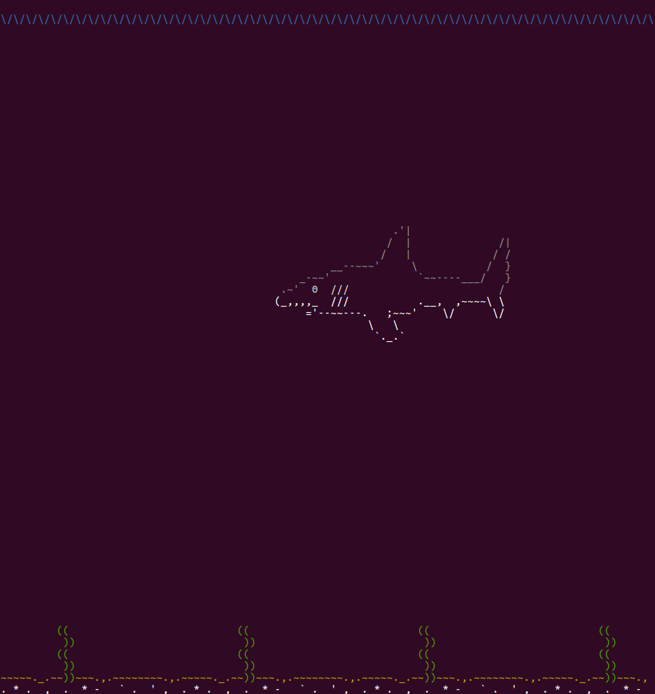
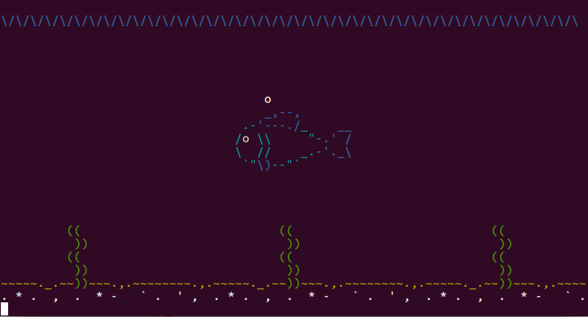

# ASCII-Aquarium
Aquarium created using ASCII art that runs in the terminal


## Requirements

- Python (2.7.x or 3.x)
- Has only been tested on Linux

## Running

Keep the aquarium.py file in the same location as the fish_art.txt file. Navigate to this location then run:

`python aquarium.py`

or if you have execute permission, simply:

`./aquarium.py`

## Screenshots





## Adding or Modifying Art

fish_art.txt contains the ASCII artwork that will be used in the application. The art must be formatted a certain way to work properly.

**Format of fish_art.txt:**
```
<BEGINNING OF FILE>
Number of fish
FISH #
Fish attributes
Animation order
STAGE 1
<art>
...
STAGE N
<art>
...
FLOOR
<art>
<END OF FILE>
```
- First line: number indicating number of fish/creatures (NOT number of "stages")

- Each new fish/creature begins with the line "FISH #" where # is an integer indicating which fish this is in the list starting with 1.

- The next line for each fish is a comma separated list indicating:

      Number of stages,length in characters of fish,depth of mouth,direction of movement,produce bubble
     - Number of stages: (integer) A fish has one "stage" for each frame of animation. The majority of the animation I made only need 3 stages
     - Length in characters of fish: (integer) find the longest line in the fish and count how many characters it is. This should be the same length for all stages of a fish
     - depth of mouth: (negative integer) This is the line where the fish's mouth/snout is and is only important if the fish will be blowing bubbles, otherwise it can be any number. 0 is the line above the fish, -1 is the first line...etc.
     - direction of movement: (R or L) simply indicates if the fish is swimming towards the (R)ight or (L)eft
     - produce bubble: (T or F) simply indicates if the fish will blow bubbles. (T)rue, it will blow bubbles or (F)alse, it will not blow bubbles.

- The next line is also a comma separated list and specifies the animation, or order of stages. It can be any length but animation frames start at 0 and automatically loops.

     >e.g. to animate STAGE 1, then STAGE 2 on loop would need the line `0,1`
     
- Then there's the actual art. Each "stage" or animation frame is separated by the line `STAGE #` where # is the stage/frame number. You may notice fish_art.txt looks messy and there are seemingly random % signs and all over the place. Each %? represents a color code. Each time a color code occurs, it means all the following characters (include the next line) will be a specific color until a new color code appears.
     
     >e.g. the line `%G...../%Y\.,,` means that ...../ will display in green text and \\.,, will display in yellow text     

     color codes are not required and "fish_art_2.txt" contains all the same ASCII art without the color codes. Possible color codes are:
     
   - %K = Black
   - %R = Red
   - %G = Green
   - %Y = Yellow
   - %B = Blue
   - %M = Magenta
   - %C = Cyan
   - %W = White
   - %g = grey
   - %r = reset (default terminal text color)

- The last part of the file is the sea floor indicated with the line `FLOOR` followed by several lines for the ASCII art. It will automatically be repeated for the width of the terminal window. So if the terminal window has a width of 80 characters, and your ASCII art for the floor is simply `~~~~`, then it will repeat the artwork 20 times (printed on the same line) to fill the rest of the window.
     
